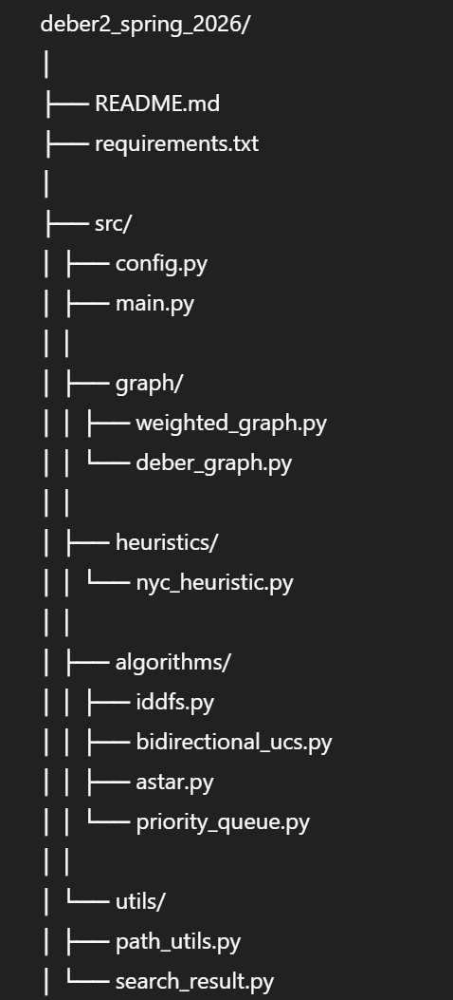

# Deber 2 – Spring 2026  
## Búsqueda Informada y No Informada  
Ruta: Elmira → New York City

---

## Integrantes

- Mateo Díaz
- Juan

---

## 1. Objetivo

Implementar en Python tres algoritmos de búsqueda para encontrar una ruta desde Elmira hasta New York City:

1. IDDFS (Iterative Deepening Depth-First Search)
2. UCS Bidireccional (Uniform Cost Search)
3. A* (A-Star) utilizando como heurística la distancia en línea recta a NYC

El costo de cada arista corresponde al valor indicado en el mapa proporcionado en el enunciado.

---

## 2. Estructura del Proyecto

---

## 3. Arquitectura

El proyecto sigue principios de separación de responsabilidades:

- El grafo y la heurística están separados de los algoritmos.
- Cada algoritmo está implementado como una clase independiente.
- Las utilidades comunes (reconstrucción de rutas, cálculo de costo) están centralizadas.
- `main.py` actúa únicamente como orquestador.

Esta organización permite:

- Fácil mantenimiento.
- Reutilización de componentes.
- Mayor claridad en la implementación.

---

## 4. Definición de "Nodo Generado"

Se considera nodo generado cada vez que:

- Se crea un hijo durante la expansión de un nodo.
- Se inserta dicho hijo en la frontera (stack o cola de prioridad).

Este criterio sigue la definición solicitada en el enunciado.

---

## 5. Desempate en Colas de Prioridad

El enunciado requiere desempate pseudo-aleatorio cuando existen prioridades iguales.

Se implementó utilizando:

Se utiliza una semilla fija (`RANDOM_SEED = 0`) para garantizar reproducibilidad de resultados.

---

## 6. Algoritmos Implementados

### 6.1 IDDFS

- Búsqueda no informada.
- Optimiza profundidad, no costo.
- No garantiza encontrar la ruta óptima en términos de distancia.

### 6.2 UCS Bidireccional

- Implementación basada en Dijkstra en ambas direcciones.
- Garantiza solución óptima con costos no negativos.
- Reduce el espacio de búsqueda respecto a UCS tradicional.

### 6.3 A*

- Utiliza la función:
  
  f(n) = g(n) + h(n)

- g(n): costo acumulado desde el inicio.
- h(n): distancia en línea recta a New York City.
- La heurística utilizada es admisible, por lo que A* garantiza optimalidad.

---

## 7. Métricas Reportadas

Para cada algoritmo se imprime:

- Ruta encontrada.
- Costo total de la ruta.
- Número de nodos generados.

---

## 8. Cómo Ejecutar

Desde la carpeta raíz del proyecto:

En PyCharm, configurar:

- Working Directory = carpeta raíz del proyecto.

---

## 9. Requisitos

- Python 3.10 o superior.
- No se requieren librerías externas.

---

## 10. Observaciones

- IDDFS puede encontrar una solución válida pero no necesariamente óptima.
- UCS Bidireccional y A* garantizan encontrar la ruta de costo mínimo.
- A* tiende a generar menos nodos gracias al uso de heurística.

